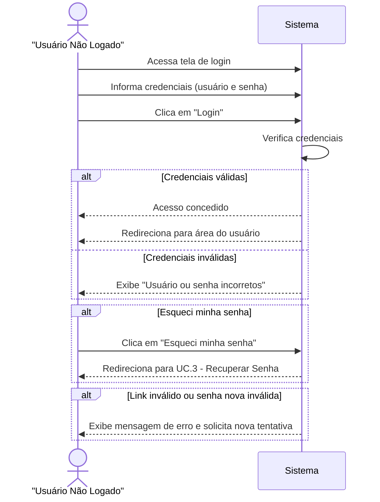

```mermaid
sequenceDiagram
    actor UsuarioNaoLogado as "Usuário Não Logado"
    participant Sistema

    UsuarioNaoLogado->>Sistema: Acessa tela de login
    UsuarioNaoLogado->>Sistema: Informa credenciais (usuário e senha)
    UsuarioNaoLogado->>Sistema: Clica em "Login"
    Sistema->>Sistema: Verifica credenciais

    alt Credenciais válidas
        Sistema-->>UsuarioNaoLogado: Acesso concedido
        Sistema-->>UsuarioNaoLogado: Redireciona para área do usuário
    else Credenciais inválidas
        Sistema-->>UsuarioNaoLogado: Exibe "Usuário ou senha incorretos"
    end

    alt Esqueci minha senha
        UsuarioNaoLogado->>Sistema: Clica em "Esqueci minha senha"
        Sistema-->>UsuarioNaoLogado: Redireciona para UC.3 - Recuperar Senha
    end

    alt Link inválido ou senha nova inválida
        Sistema-->>UsuarioNaoLogado: Exibe mensagem de erro e solicita nova tentativa
    end
```
